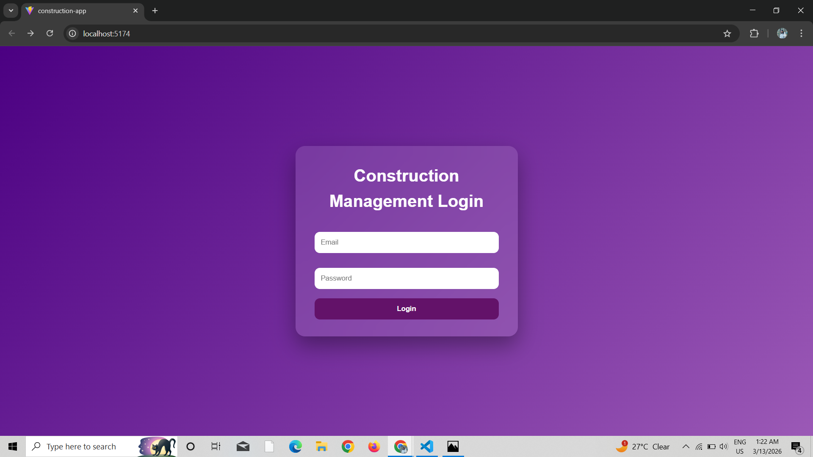
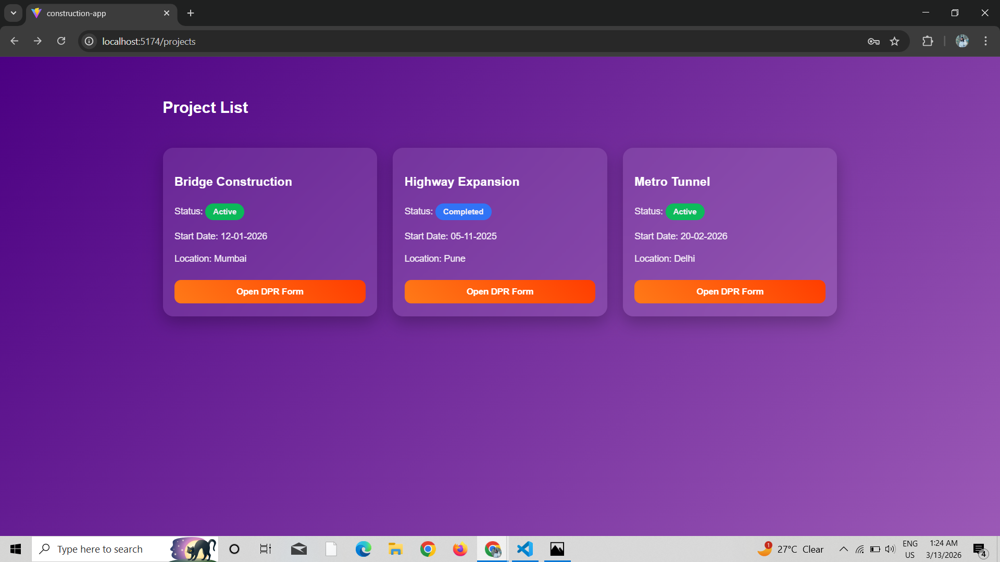
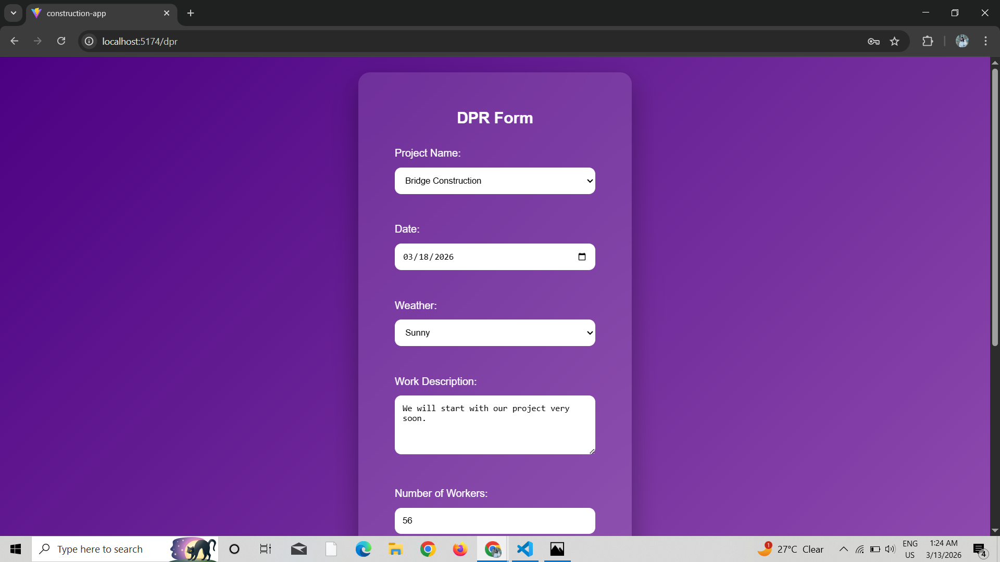

# React + Vite

This template provides a minimal setup to get React working in Vite with HMR and some ESLint rules.

Currently, two official plugins are available:

- [@vitejs/plugin-react](https://github.com/vitejs/vite-plugin-react/blob/main/packages/plugin-react) uses [Babel](https://babeljs.io/) (or [oxc](https://oxc.rs) when used in [rolldown-vite](https://vite.dev/guide/rolldown)) for Fast Refresh
- [@vitejs/plugin-react-swc](https://github.com/vitejs/vite-plugin-react/blob/main/packages/plugin-react-swc) uses [SWC](https://swc.rs/) for Fast Refresh

# Construction Management DPR App

A simple Construction Management Web Application built using React.  
This app allows users to view projects and submit Daily Progress Reports (DPR).

---

## Features

- Login Page
- Project Dashboard
- Daily Progress Report (DPR) Form
- Image Upload with Preview
- DPR History Table
- Clean Dashboard UI

---

## Tech Stack

- React
- Vite
- JavaScript
- CSS
- React Router

---

## Project Structure
src
│
├── pages
│ ├── Login.jsx
│ ├── Projects.jsx
│ └── DPRForm.jsx
│
├── data
│ └── projects.js
│
├── App.jsx
├── main.jsx
└── index.css

---

## Future Improvements

- Authentication system
- Backend integration
- Cloud image storage
- Project analytics dashboard

---

## Author

Komal Shirke  
IT Engineering Student

## React Compiler

The React Compiler is not enabled on this template because of its impact on dev & build performances. To add it, see [this documentation](https://react.dev/learn/react-compiler/installation).

## Expanding the ESLint configuration

If you are developing a production application, we recommend using TypeScript with type-aware lint rules enabled. Check out the [TS template](https://github.com/vitejs/vite/tree/main/packages/create-vite/template-react-ts) for information on how to integrate TypeScript and [`typescript-eslint`](https://typescript-eslint.io) in your project.

# Construction Management DPR App

## Login Page

## Project Dashboard

## DPR Form
